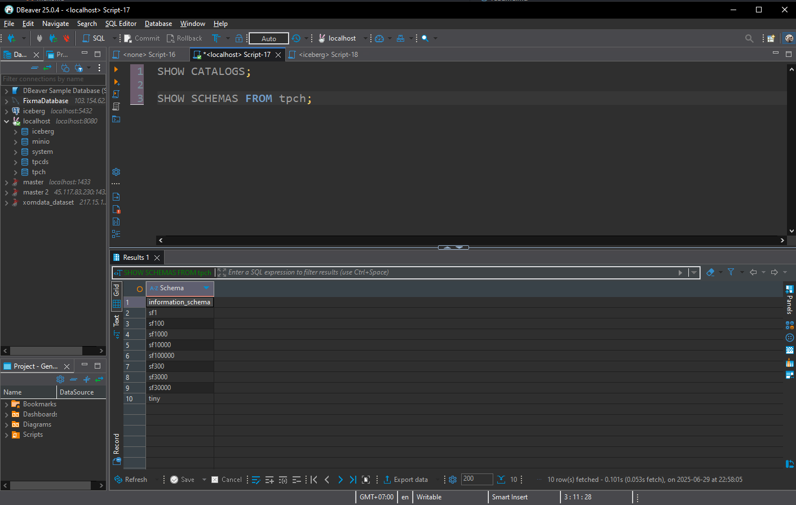
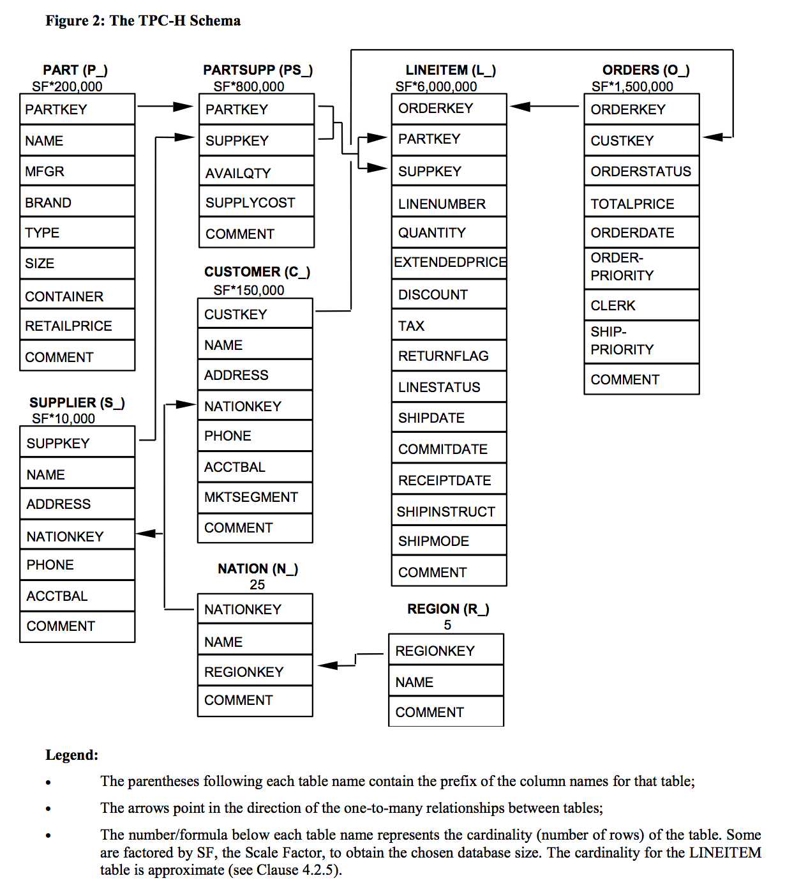

# 🚀 Hướng Dẫn Cài Đặt Môi Trường – Phân tích dữ liệu với Trino & TPC-H

Chào mừng bạn đến với dự án học SQL phân tích trên hệ cơ sở dữ liệu OLAP sử dụng **Trino** và bộ dữ liệu **TPC-H**. Hướng dẫn này sẽ giúp bạn cài đặt và khởi chạy môi trường làm việc chỉ trong vài bước đơn giản.

---

## 🧰 Cần chuẩn bị những gì?

1. [Git >= 2.37.1](https://github.com/git-guides/install-git)
2. [Docker >= 20.10.17](https://docs.docker.com/engine/install/) và [Docker Compose v2 >= 2.10.2](https://docs.docker.com/compose/)

### 💡 Nếu bạn dùng Windows:
- Cài **WSL** + Ubuntu theo [hướng dẫn này](https://ubuntu.com/tutorials/install-ubuntu-on-wsl2-on-windows-10#1-overview)
- Cài Docker bên trong Ubuntu (nếu chưa có thì xem [bài viết này](https://www.digitalocean.com/community/tutorials/how-to-install-and-use-docker-on-ubuntu-22-04#step-1-installing-docker))
- Cài thêm `make` bằng lệnh:

```bash
sudo apt install make -y
```

---

## 📥 Tải về mã nguồn

```bash
git clone https://github.com/josephmachado/analytical_dp_with_sql.git
cd analytical_dp_with_sql
```

> 💻 Người dùng Macbook M1 nên xem thêm [lưu ý này](https://github.com/josephmachado/analytical_dp_with_sql/issues/4#issuecomment-1426902080)

---

## 🐳 Khởi động môi trường làm việc

```bash
# Kiểm tra Docker đang chạy
docker ps

# Khởi chạy toàn bộ container
make up

# Nếu có lỗi, xóa toàn bộ container bằng:
# docker rm -f $(docker ps -a -q)

# Chờ khoảng 60 giây để hệ thống sẵn sàng
sleep 60

# Mở giao diện dòng lệnh Trino
make trino
```

---

## 🧪 Thử truy vấn Trino với bộ dữ liệu TPC-H

```sql
-- Gõ trong CLI của Trino:
USE tpch.tiny;
SHOW tables;
SELECT * FROM orders LIMIT 5;
exit;
```

📦 Trino có sẵn nhiều bộ dữ liệu mẫu theo các mức độ lớn nhỏ: `tiny`, `sf1`, `sf100`, v.v.

---

## 🌐 Truy cập giao diện Web

- Giao diện Trino: [http://localhost:8080](http://localhost:8080) (username gõ gì cũng được)
- Giao diện MinIO (giả lập S3): [http://localhost:9001](http://localhost:9001)  
  - Tài khoản: `minio`  
  - Mật khẩu: `minio123`

---

## 🖥️ Kết nối Trino bằng DBeaver (tùy chọn)

1. Tải [DBeaver tại đây](https://dbeaver.io/)
2. Vào `Database` → `New Database Connection`
3. Chọn `Trino` → Next
4. Để nguyên cấu hình mặc định → Nhập user là `user`
5. Test connection → Finish



---

## 🗺️ Mô hình dữ liệu TPC-H

Bộ dữ liệu TPC-H mô phỏng một doanh nghiệp bán linh kiện xe hơi gồm:

- Đơn hàng (orders)
- Sản phẩm trong đơn (lineitem)
- Khách hàng
- Nhà cung cấp
- Khu vực, quốc gia, sản phẩm...



> 📌 Bạn nên giữ sơ đồ này bên cạnh khi học và làm bài tập.

---

## 🙌 Ghi chú cảm ơn

Dự án này sử dụng:

- Bộ dữ liệu [TPC-H](https://www.tpc.org/tpch/)
- Công cụ xử lý truy vấn OLAP [Trino](https://trino.io/)