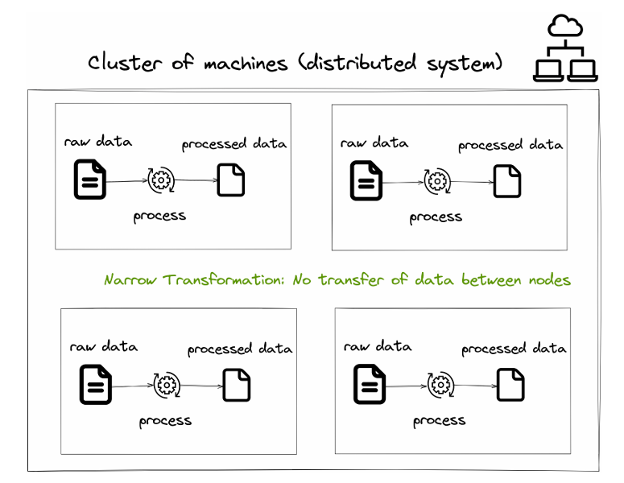
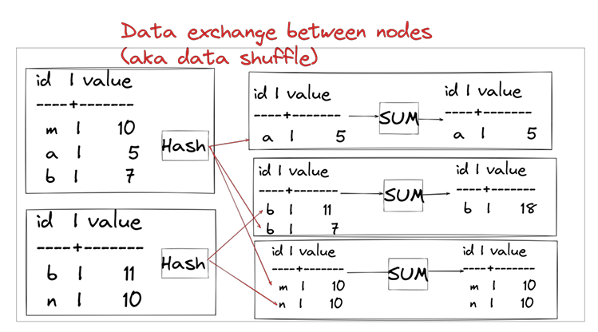

# 🔄 4.2. So sánh Narrow Transformation và Wide Transformation trong OLAP

Trong hệ thống xử lý dữ liệu phân tán như Trino, việc hiểu sự khác biệt giữa **Narrow** và **Wide Transformations** là rất quan trọng để tối ưu truy vấn và giảm chi phí tính toán.

---

## ⚙️ Narrow Transformation

| Thuộc tính        | Mô tả |
|--------------------|------|
| ✅ Định nghĩa      | Phép biến đổi **không yêu cầu truyền dữ liệu giữa các node**. |
| 🔍 Cách xử lý      | Dữ liệu được xử lý **tại chính node chứa nó**, không có shuffle. |
| 🧠 Đặc điểm        | Mỗi dòng dữ liệu được xử lý **độc lập**, không phụ thuộc dòng khác. |
| ⚡ Hiệu suất       | **Cao**, do không tốn chi phí truyền tải. |
| 💡 Ví dụ           | Tính toán trên từng dòng: `SELECT price * 1.1 FROM sales`. |
| 🔥 Loại phép biến đổi | `SELECT`, `WHERE`, `COLUMN CALCULATION`, v.v. |

---

## 🌐 Wide Transformation

| Thuộc tính        | Mô tả |
|--------------------|------|
| ✅ Định nghĩa      | Phép biến đổi **cần di chuyển dữ liệu giữa các node** để gom nhóm hoặc nối. |
| 🔍 Cách xử lý      | Hệ thống sử dụng **hash + shuffle** để gom dữ liệu cùng key về một node. |
| 🧠 Đặc điểm        | Cần kết hợp thông tin từ **nhiều dòng hoặc nhiều bảng**. |
| ⚠️ Chi phí         | **Cao hơn** do phải truyền dữ liệu qua mạng. |
| 💡 Ví dụ           | `JOIN`, `GROUP BY`, `DISTINCT`, `WINDOW FUNCTIONS` |
| 🔄 Tên khác        | **Data Shuffle**, **Exchange**, **Repartitioning** |

---

## 🎯 Tổng so sánh

| Tiêu chí                 | Narrow Transformation        | Wide Transformation            |
|--------------------------|------------------------------|--------------------------------|
| Cần truyền dữ liệu?      | ❌ Không                     | ✅ Có                          |
| Diễn ra tại local node?  | ✅ Có                        | ❌ Không hoàn toàn             |
| Ví dụ phổ biến           | `SELECT`, `WHERE`, phép toán đơn | `JOIN`, `GROUP BY`, `DISTINCT` |
| Tốn chi phí mạng         | ❌ Không                     | ✅ Có                          |
| Dễ tối ưu hóa            | ✅ Dễ                        | ⚠️ Cần cân nhắc kỹ            |

---

💡 **Mẹo tối ưu hiệu suất:**
- Luôn cố gắng giữ phép biến đổi ở mức **narrow** nếu có thể.
- Sử dụng `EXPLAIN` trong Trino để phát hiện **Exchange** – dấu hiệu của wide transformation.
