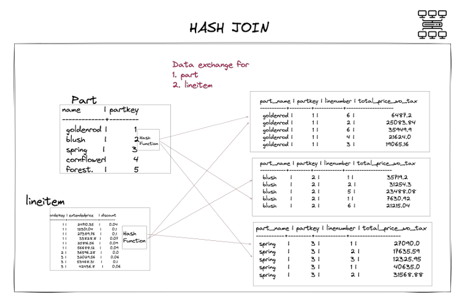
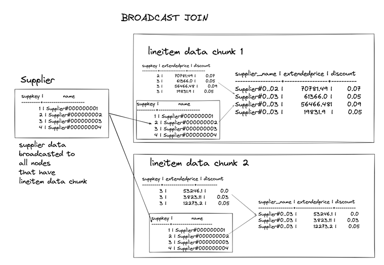

# 🔄 4.3. So sánh Hash Join và Broadcast Join trong hệ thống OLAP (Trino)

Khi làm việc với các truy vấn JOIN trong hệ thống cơ sở dữ liệu phân tán như Trino, hai chiến lược JOIN phổ biến nhất là **Hash Join** và **Broadcast Join**. Việc lựa chọn đúng loại JOIN có thể ảnh hưởng lớn đến hiệu suất truy vấn.

---

## ⚙️ 1. Hash Join

| Thuộc tính | Mô tả |
|------------|-------|
| ✅ Khi nào dùng? | Khi **cả hai bảng đều lớn**, không thể broadcast bảng nào. |
| 🔄 Cách hoạt động | Dữ liệu từ cả hai bảng được **hash và phân phối lại (shuffle)** đến các node theo khóa JOIN. |
| ⚠️ Chi phí | Cao – do phải **truyền dữ liệu cả hai phía qua mạng**. |
| 💡 Ví dụ | JOIN giữa hai bảng fact (`lineitem` và `orders`) trong `tpch.sf10`. |
| 📌 Phân phối trong Trino | `distribution = PARTITIONED` |

---

## 🚀 2. Broadcast Join

| Thuộc tính | Mô tả |
|------------|-------|
| ✅ Khi nào dùng? | Khi một bảng **rất nhỏ** (thường là dimension table). |
| 📦 Cách hoạt động | Bảng nhỏ được **gửi (broadcast)** đến tất cả các node chứa bảng lớn. |
| ⚡ Hiệu suất | Tốt – **tránh shuffle bảng lớn**, giảm độ trễ truy vấn. |
| 💡 Ví dụ | JOIN giữa `lineitem` (fact) và `supplier` (dimension) trong `tpch.tiny`. |
| 📌 Phân phối trong Trino | `distribution = REPLICATED` |
| 🔧 Tùy chỉnh | Có thể ép bằng: `SET SESSION join_max_broadcast_table_size = '100MB';` |

---

## 🎯 Tổng kết

| Tiêu chí                  | Hash Join                          | Broadcast Join                        |
|---------------------------|------------------------------------|----------------------------------------|
| Phù hợp với              | Bảng lớn ↔ Bảng lớn                | Bảng lớn ↔ Bảng nhỏ                    |
| Cách xử lý               | Shuffle cả hai bảng                | Broadcast bảng nhỏ                    |
| Chi phí mạng             | Cao                                | Thấp                                  |
| Dễ xảy ra skew           | Có thể                             | Ít xảy ra                              |
| Mặc định trong Trino     | Tùy vào kích thước bảng            | Tự động nếu bảng nhỏ dưới ngưỡng cấu hình |

---

🔍 *Sử dụng `EXPLAIN` trong Trino để xem loại JOIN được chọn:*  
- `PARTITIONED` → Hash Join  
- `REPLICATED` → Broadcast Join

👉 *Tối ưu truy vấn JOIN đúng cách có thể giúp giảm 50-90% thời gian chạy và chi phí tính toán!*
