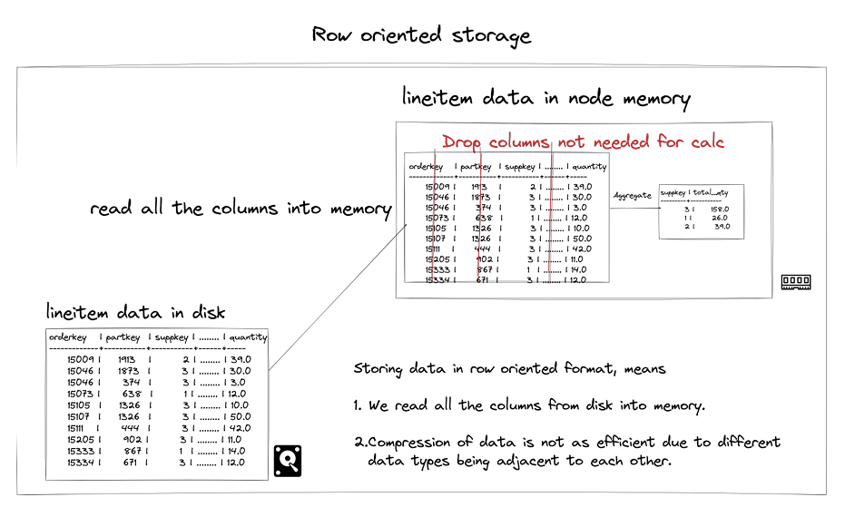
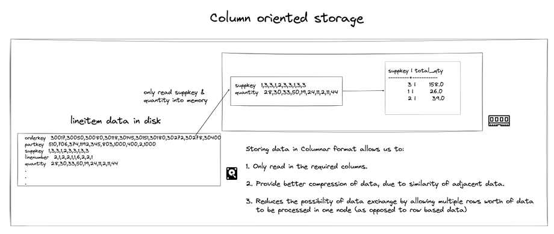
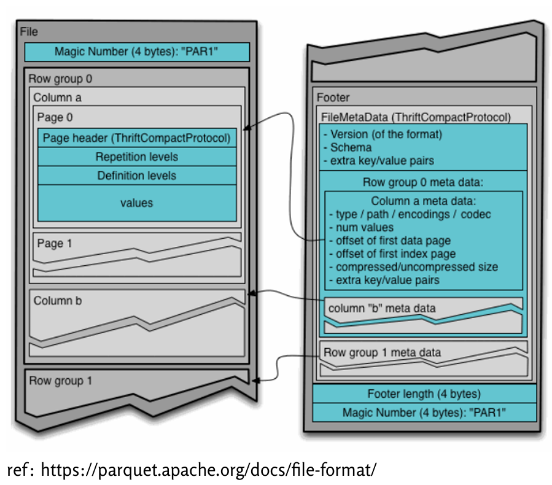

# 📊 4.5.1 Định dạng lưu trữ theo cột (Column-oriented formatting)

Trong các hệ thống cơ sở dữ liệu phân tán như Trino, định dạng dữ liệu theo **cột** (column-oriented) đóng vai trò rất quan trọng trong việc tối ưu hóa truy vấn phân tích.



---

## ❓ Vì sao cần định dạng cột?

Truy vấn phân tích (OLAP) thường chỉ làm việc với một vài cột trong bảng rất lớn.  
Nếu dữ liệu được lưu theo **dòng**, hệ thống phải **đọc toàn bộ các cột**, kể cả những cột không cần dùng → gây **lãng phí bộ nhớ và làm chậm truy vấn**.



---

## 🔍 So sánh hiệu suất thực tế


```sql
-- Bảng định dạng cột (PARQUET)
SELECT suppkey, SUM(quantity) AS total_qty
FROM minio.tpch.lineitem_w_encoding
GROUP BY suppkey;
-- ⏱️ Kết quả: 2.22s | 6M rows | 14.5MB | 2.7M rows/s

-- Bảng định dạng dòng (TEXTFILE)
SELECT suppkey, SUM(quantity) AS total_qty
FROM minio.tpch.lineitem_wo_encoding
GROUP BY suppkey;
-- ⏱️ Kết quả: 10.98s | 6M rows | 215MB | 547K rows/s
```

📌 Chênh lệch gần **5 lần về tốc độ** và **15 lần về dữ liệu đọc**.

---

## ✅ Ưu điểm của định dạng cột

- **Chỉ đọc cột cần thiết (column pruning)**
- **Giảm dung lượng bộ nhớ cần thiết**
- **Hỗ trợ nén tốt hơn** vì mỗi cột có kiểu dữ liệu giống nhau
- **Tăng tốc độ xử lý truy vấn** trong các tình huống phân tích (group by, filter, aggregate…)

---

## 🧱 Cấu trúc lưu trữ của Apache Parquet

Khi tạo bảng định dạng `PARQUET`, mỗi file Parquet gồm 3 phần chính:

1. **RowGroups**  
   Nhóm các dòng; mỗi RowGroup chứa đủ cột cho các dòng trong nhóm.

2. **ColumnChunks**  
   Mỗi cột trong RowGroup được lưu riêng biệt → giúp đọc theo cột.

3. **FileMetaData**  
   Chứa thông tin vị trí offset của các cột, kiểu mã hóa, kích thước…  
   → Giúp hệ quản trị chỉ đọc đúng phần cần thiết.



---

## ⚙️ Quá trình Trino truy vấn bảng Parquet

1. **Đọc FileMetaData** để xác định cần đọc cột nào, ở vị trí nào
2. **Truy cập trực tiếp đến vị trí offset** của cột và chỉ đọc đúng phần dữ liệu cần


---

## 🔚 Kết luận

- Định dạng cột (như **Parquet** hoặc **ORC**) là lựa chọn **tối ưu** cho truy vấn phân tích trong OLAP.
- Kết hợp với các kỹ thuật khác như **partitioning**, **bucketing**, định dạng cột giúp tiết kiệm đáng kể thời gian và tài nguyên.

👉 *Nếu bạn làm việc với dữ liệu lớn và truy vấn phân tích, hãy luôn ưu tiên định dạng cột thay vì dòng!*
