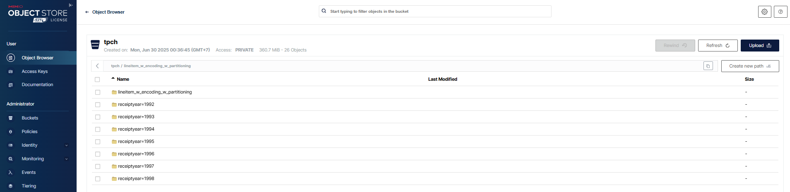

# 🗂️ 4.5.2 Partitioning – Phân vùng dữ liệu để tối ưu truy vấn

---

## ✅ Mục tiêu

Mặc dù định dạng cột (columnar) giúp OLAP DB chỉ đọc những cột cần thiết, nhưng hệ thống vẫn phải **đọc metadata của từng file**.  
**Phân vùng (partitioning)** giúp **tránh đọc metadata không cần thiết** bằng cách tổ chức dữ liệu theo thư mục, mỗi thư mục ứng với giá trị của cột phân vùng.

---

## 📁 Hive-style Partitioning

Partition theo cột `receiptyear` sẽ tạo thư mục:

```
s3a://tpch/lineitem_w_encoding_w_partitioning/receiptyear=1994/
s3a://tpch/lineitem_w_encoding_w_partitioning/receiptyear=1995/
...
```

Khi lọc `WHERE receiptyear = '1994'`, Trino **chỉ cần đọc thư mục đó**, giúp tăng hiệu suất rõ rệt.

---

## 🧪 Ví dụ SQL tạo bảng có phân vùng

```sql
DROP TABLE IF EXISTS minio.tpch.lineitem_w_encoding_w_partitioning;

CREATE TABLE minio.tpch.lineitem_w_encoding_w_partitioning (
  orderkey bigint,
  partkey bigint,
  suppkey bigint,
  linenumber integer,
  quantity double,
  extendedprice double,
  discount double,
  tax double,
  shipinstruct varchar(25),
  shipmode varchar(10),
  COMMENT varchar(44),
  commitdate date,
  linestatus varchar(1),
  returnflag varchar(1),
  shipdate date,
  receiptdate date,
  receiptyear varchar(4)
) WITH (
  external_location = 's3a://tpch/lineitem_w_encoding_w_partitioning/',
  partitioned_by = ARRAY ['receiptyear'],
  format = 'PARQUET'
);
```



---

## 🚀 Insert dữ liệu và tạo giá trị partition

```sql
USE tpch.tiny;

INSERT INTO minio.tpch.lineitem_w_encoding_w_partitioning
SELECT
  orderkey,
  partkey,
  suppkey,
  linenumber,
  quantity,
  extendedprice,
  discount,
  tax,
  shipinstruct,
  shipmode,
  COMMENT,
  commitdate,
  linestatus,
  returnflag,
  shipdate,
  receiptdate,
  CAST(YEAR(receiptdate) AS varchar(4)) AS receiptyear
FROM tpch.tiny.lineitem;
```

---

## 🔍 So sánh hiệu suất

```sql
-- Không phân vùng:
EXPLAIN ANALYZE
SELECT * FROM tpch.tiny.lineitem
WHERE year(receiptdate) = 1994;
-- Input: ~60,175 dòng

-- Có phân vùng:
EXPLAIN ANALYZE
SELECT * FROM minio.tpch.lineitem_w_encoding_w_partitioning
WHERE receiptyear = '1994';
-- Input: ~9,525 dòng
```

📌 Chỉ đọc đúng phân vùng `receiptyear=1994` → tiết kiệm tài nguyên đáng kể.

---

## ⚠️ Lưu ý khi partition

### 1. Cardinality (Độ phân biệt)
- Nên partition theo cột **ít giá trị** (năm, tháng, vùng…)
- Nếu partition theo cột có **nhiều giá trị duy nhất** (ID, giá trị, ngày cụ thể...), sẽ tạo quá nhiều thư mục nhỏ → gây quá tải
- Ví dụ: BigQuery giới hạn 4000 partition/table

### 2. Chi phí xử lý lại (Reprocessing)
- Thay đổi cột partition sẽ yêu cầu **xử lý lại toàn bộ dữ liệu**
- Apache Iceberg và Hudi hỗ trợ xử lý lại partition hiệu quả hơn

---

## 📦 Partition nhiều cấp (multi-level)

Bạn có thể phân vùng theo nhiều cột, ví dụ:

```bash
s3a://tpch/table_path/receiptyear=1994/receiptmonth=03/
```

---

👉 *Partitioning là cách đơn giản mà mạnh mẽ để giảm chi phí đọc dữ liệu khi truy vấn OLAP!*
