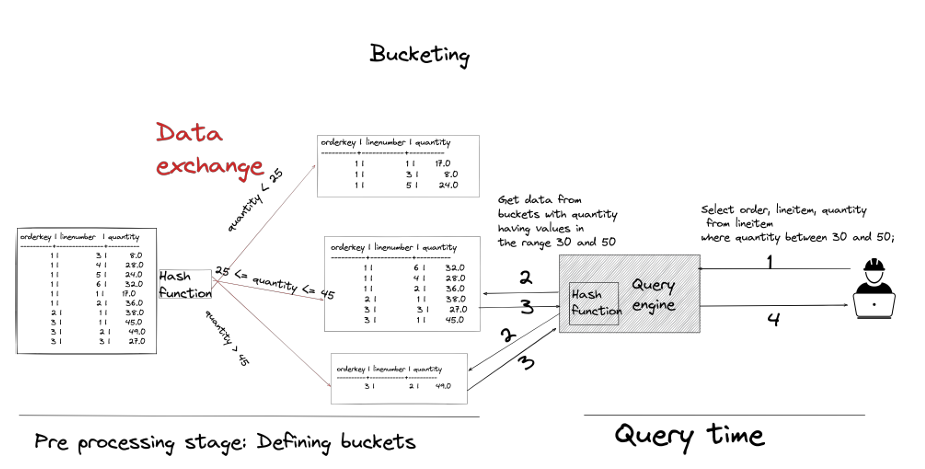
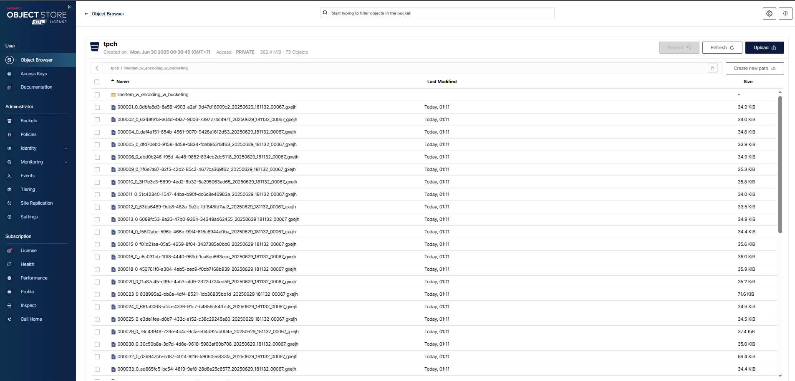

# 🧊 4.5.3 Bucketing – Chia nhóm dữ liệu để truy vấn nhanh hơn

---

## 🔍 Bucketing là gì?

Trong khi partitioning phù hợp với các cột có **ít giá trị duy nhất (low cardinality)**, thì **Bucketing** là giải pháp thay thế hiệu quả cho **các cột có nhiều giá trị duy nhất (high cardinality)**.

**Bucketing = chia bảng thành nhiều “bucket” (nhóm)** dựa trên **hàm băm (hash)** của giá trị trong một hoặc nhiều cột được chỉ định.



---

## 🧠 Cách hoạt động

- Khi tạo bảng có bucketing, bạn chỉ định **số lượng bucket** và **các cột để chia bucket**.
- Khi chạy truy vấn có điều kiện lọc theo cột đó, OLAP DB sẽ dùng **hàm băm** để xác định **bucket nào cần đọc**.
- Điều này giúp **giảm lượng dữ liệu cần quét (scan)** → truy vấn nhanh hơn.

---

## 📦 Ví dụ tạo bảng có bucketing theo `quantity`

```sql
DROP TABLE IF EXISTS minio.tpch.lineitem_w_encoding_w_bucketing;

CREATE TABLE minio.tpch.lineitem_w_encoding_w_bucketing (
  orderkey bigint,
  partkey bigint,
  suppkey bigint,
  linenumber integer,
  quantity double,
  extendedprice double,
  discount double,
  tax double,
  shipinstruct varchar(25),
  shipmode varchar(10),
  COMMENT varchar(44),
  commitdate date,
  linestatus varchar(1),
  returnflag varchar(1),
  shipdate date,
  receiptdate date
) WITH (
  external_location = 's3a://tpch/lineitem_w_encoding_w_bucketing/',
  format = 'PARQUET',
  bucket_count = 75,
  bucketed_by = ARRAY ['quantity']
);
```



---

## ➕ Chèn dữ liệu

```sql
USE tpch.tiny;

INSERT INTO minio.tpch.lineitem_w_encoding_w_bucketing (
  orderkey, partkey, suppkey, linenumber,
  quantity, extendedprice, discount, tax,
  shipinstruct, shipmode, COMMENT, commitdate,
  linestatus, returnflag, shipdate, receiptdate
)
SELECT
  orderkey, partkey, suppkey, linenumber,
  quantity, extendedprice, discount, tax,
  shipinstruct, shipmode, comment, commitdate,
  linestatus, returnflag, shipdate, receiptdate
FROM tpch.tiny.lineitem;
```

---

## ⚡ So sánh truy vấn có điều kiện lọc `quantity`

```sql
-- Truy vấn bảng gốc (không bucket):
EXPLAIN ANALYZE
SELECT * FROM tpch.tiny.lineitem
WHERE quantity BETWEEN 30 AND 45;
-- Input: ~60,175 rows, Filtered: 68.14%

-- Truy vấn bảng có bucketing:
EXPLAIN ANALYZE
SELECT * FROM minio.tpch.lineitem_w_encoding_w_bucketing
WHERE quantity BETWEEN 30 AND 45;
-- Input: ~21,550 rows (giảm 65%)
-- Filtered: 11.03%
```

✅ Bucketing giúp **giảm đáng kể lượng dòng cần quét** (từ 60K xuống còn 21K).

---

## ⚠️ Lưu ý khi sử dụng bucketing

1. **Phân bố dữ liệu đều (uniform distribution)** giúp các bucket có kích thước tương đương.
2. Nếu cột chia bucket có giá trị xuất hiện quá chênh lệch → một số bucket sẽ to hơn nhiều → làm chậm truy vấn.
3. Cần xác định số lượng bucket phù hợp với dữ liệu và workload.

---

## 📝 Bài tập mở rộng

Tạo bảng với 100 bucket chia theo `quantity` và chạy truy vấn lọc `quantity BETWEEN 30 AND 45`:

```sql
DROP TABLE IF EXISTS minio.tpch.lineitem_w_encoding_w_bucketing_eg;

CREATE TABLE minio.tpch.lineitem_w_encoding_w_bucketing_eg (
  orderkey bigint,
  partkey bigint,
  suppkey bigint,
  linenumber integer,
  quantity double,
  extendedprice double,
  discount double,
  tax double,
  shipinstruct varchar(25),
  shipmode varchar(10),
  COMMENT varchar(44),
  commitdate date,
  linestatus varchar(1),
  returnflag varchar(1),
  shipdate date,
  receiptdate date
) WITH (
  external_location = 's3a://tpch/lineitem_w_encoding_w_bucketing_eg/',
  format = 'PARQUET',
  bucket_count = 100,
  bucketed_by = ARRAY ['quantity']
);

INSERT INTO minio.tpch.lineitem_w_encoding_w_bucketing_eg
SELECT * FROM lineitem;

EXPLAIN ANALYZE
SELECT *
FROM minio.tpch.lineitem_w_encoding_w_bucketing_eg
WHERE quantity BETWEEN 30 AND 45;
```

---

👉 *Bucketing là công cụ mạnh mẽ để tối ưu hiệu suất truy vấn khi partition không còn hiệu quả do dữ liệu có độ phân biệt cao.*
