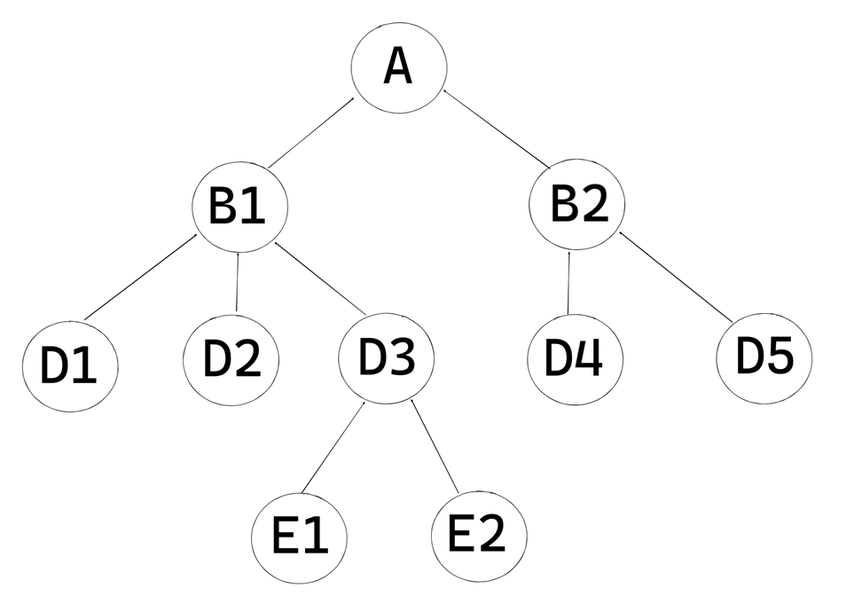

# 🔁 Chương 6 – Recursive CTE & Patterns thường gặp trong SQL phân tích

Chương này tập trung vào các mẫu truy vấn nâng cao thường gặp trong các bài toán phân tích dữ liệu, bao gồm:

---

## 📚 Cấu trúc chương 

| Phần | Nội dung chính | File SQL |
|------|----------------|----------|
| 6.1 | Đệ quy trong SQL với WITH RECURSIVE | `6.1_recursive_cte.sql` |
| 6.2.1 | Loại bỏ dòng trùng (Deduplication) | `6.2.1_deduping.sql` |
| 6.2.2 | Pivot dữ liệu | `6.2.2_pivot.sql` |
| 6.2.3 | Tính tăng trưởng theo kỳ (DoD, MoM, YoY) | `6.2.3_period_growth.sql` |
| 6.2.4 | GROUP BY nhiều tổ hợp cột | `6.2.4_grouping_sets.sql` |

---

## 📌 Một số kỹ thuật nổi bật

### 🔁 WITH RECURSIVE
- Cho phép viết truy vấn dạng lặp/đệ quy trong SQL
- Ứng dụng: dựng chuỗi báo cáo trong sơ đồ tổ chức, tạo dãy thời gian liên tục, v.v.

### 🧹 Deduplication
- Dùng `ROW_NUMBER()` để giữ lại dòng đầu tiên theo khóa chính hoặc timestamp
- Hiệu quả hơn GROUP BY toàn bộ cột

### 🔄 Pivot (CASE trong AVG/SUM)
- Biến các giá trị phân loại thành từng cột riêng để hiển thị trực quan

### 📈 Period-over-Period growth
- Dùng `LAG()` hoặc `LEAD()` để tính % thay đổi giữa các kỳ
- Ứng dụng: MoM, YoY, DoD,…

### 🧩 GROUPING SETS
- Cho phép GROUP BY nhiều cấp độ trong 1 truy vấn duy nhất

---

## ⚠️ Lưu ý

- Recursive CTE cần đặt giới hạn `SET SESSION max_recursion_depth`
- Pivot thường đi kèm với `CASE WHEN ... THEN ... ELSE ...`
- GROUPING SETS giúp giảm số lần scan dữ liệu hơn UNION nhiều truy vấn

---

👉 Đây là chương quan trọng để bạn xử lý linh hoạt các yêu cầu phân tích thực tế trong business.